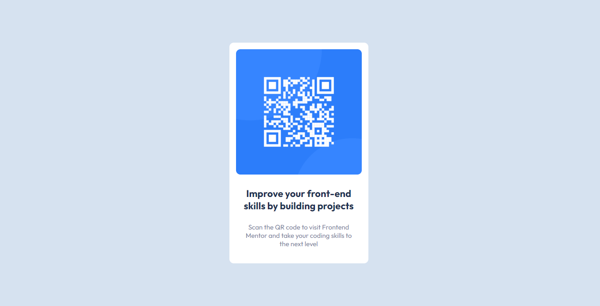

# Frontend Mentor - QR code component solution

This is a solution to the [QR code component challenge on Frontend Mentor](https://www.frontendmentor.io/challenges/qr-code-component-iux_sIO_H). Frontend Mentor challenges help you improve your coding skills by building realistic projects.

## Table of contents

- [Frontend Mentor - QR code component solution](#frontend-mentor---qr-code-component-solution)
  - [Table of contents](#table-of-contents)
  - [Overview](#overview)
    - [Screenshot](#screenshot)
    - [Links](#links)
  - [My process](#my-process)
    - [Built with](#built-with)
    - [What I learned](#what-i-learned)
      - [1- In HTML](#1--in-html)
      - [2- In CSS](#2--in-css)
      - [3-In Skills](#3-in-skills)
    - [Continued development](#continued-development)
    - [Useful resources](#useful-resources)
  - [Author](#author)
  - [Acknowledgments](#acknowledgments)

## Overview

### Screenshot



### Links

- Solution URL: [https://www.frontendmentor.io/solutions/semantic-html-bem-naming-css-flexbox-custom-css-class-name-styling-pZUA-YZc-g](https://www.frontendmentor.io/solutions/semantic-html-bem-naming-css-flexbox-custom-css-class-name-styling-pZUA-YZc-g)
- Live Site URL: [https://loukhai.github.io/FRONTEND-MENTOR---QR-code-component-/](https://loukhai.github.io/FRONTEND-MENTOR---QR-code-component-/)
- GitHub Repo : [rabia loukhai FrontendMentor solution QR-code-component](https://github.com/Loukhai/FRONTEND-MENTOR---QR-code-component-)

## My process

### Built with

- Semantic HTML5 markup
- custom CSS properties
- Flexbox
- B.E.M Naming methodology

### What I learned

#### 1- In HTML

I made sure the QR card with a semantic HTML with practicing the BEM methodology in the classes nomination.

```html
<div class="container__card flex_center">
  <main class="card flex_center">
    <div class="card__imgContainer">
      
    </div>
    <article class="card__description flex_center">
      <h1 class="description__title">
        Improve your front-end skills by building projects
      </h1>
      <p class="description__text">
        Scan the QR code to visit Frontend Mentor and take your coding skills to
        the next level
      </p>
    </article>
  </main>
</div>
```

#### 2- In CSS

I make a custom class to don't repeat my self in styling (like a DRY principe but in css)

```css
.flex_center {
  display: flex;
  justify-content: center;
  align-items: center;
  flex-wrap: nowrap;
  flex-direction: column;
  gap: 25px;
}
```

#### 3-In Skills

This is my first time that i write a documentation, i guess that is good practice to improve the thinking of the developer it self and the others of their codes and their the English language for anglophone people.

### Continued development

I will be practice more projects to improve my skills like a front-end web developer

### Useful resources

- [Markdown Cheat Sheet](https://www.markdownguide.org/cheat-sheet/) - This helped me for written a MD file. I really liked this cheat-sheet and will use it going forward.

- [B.E.M Naming Methodology](https://getbem.com/naming/) - This is an amazing article which helped me finally understand BEM Naming. I'd recommend it to anyone still learning this concept.

## Author

- Website - [Rabiâ LOUKHAI](https://rabie.vercel.app)
- Frontend Mentor - [@Loukhai](https://www.frontendmentor.io/profile/Loukhai)
- Twitter - [@loukhai_rabia](https://www.twitter.com/loukhai_rabia)
- Linkedin - [Rabiâ Loukhai](https://www.linkedin.com/in/rabi%C3%A2-l-9172a2136/)

## Acknowledgments

- The helpful recommendations from the COMMUNITY FEEDBACK of Frontend Mentor ❤️.
